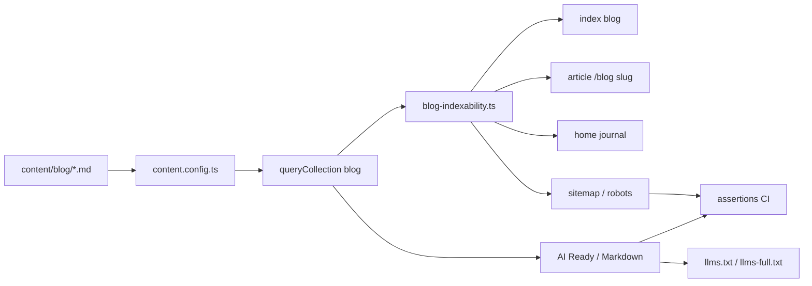
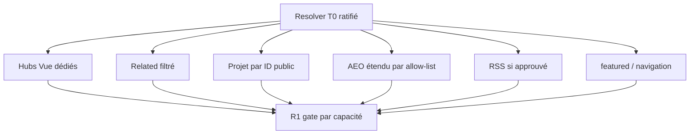
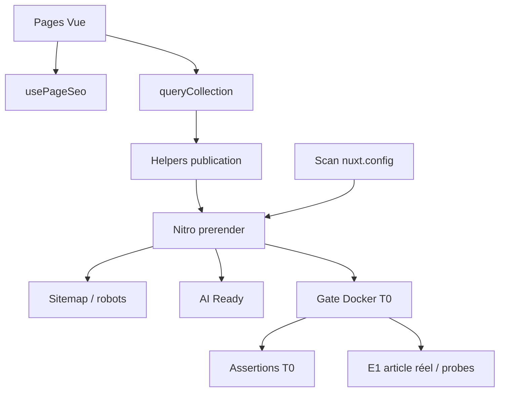
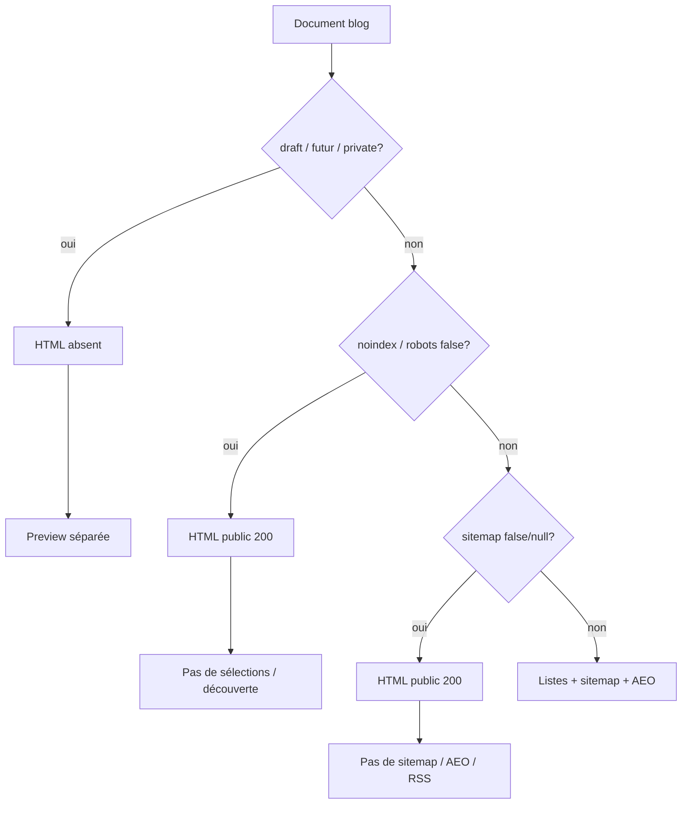
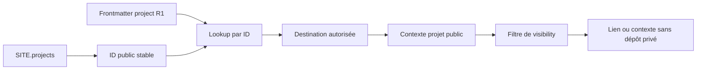
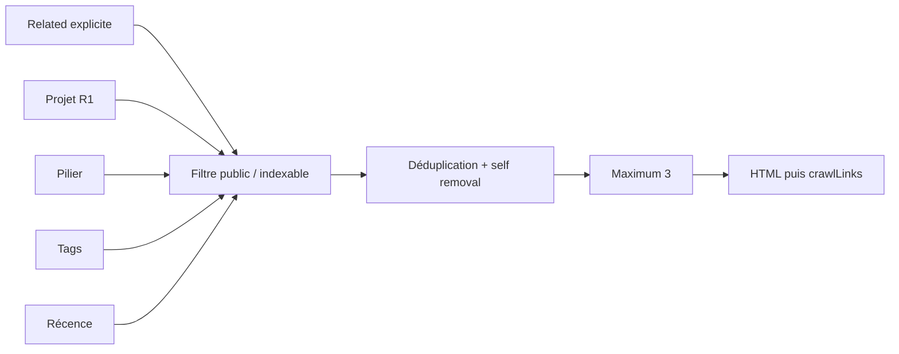
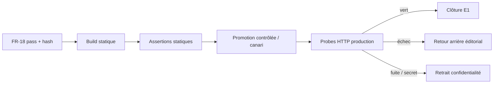

# Diagrammes d'architecture, de visibility et de distribution

> Companion de la SPEC blog éditorial. Les flux T0 sont la cible de la première livraison ; les flux R1 sont conditionnels et ne doivent pas être réintroduits dans T0 par un simple lien ou une configuration de scan.

## 1. Flux brownfield actuel



## 2. Flux T0 — préparation technique

```mermaid
flowchart TD
  C[Article Markdown minimal] --> V[Contrat éditorial T0]
  V --> R[Resolver partagé de visibility]
  R --> PUB[Publication / exclusion]
  R --> HOME[/ et /blog]
  R --> ART[Article public]
  PUB --> SEO[usePageSeo / BlogPosting]
  PUB --> SITE[Sitemap / robots]
  PUB --> AEO[AI Ready existant]
  HOME --> T0[Gate T0]
  ART --> T0
  SEO --> T0
  SITE --> T0
  AEO --> T0
  T0 --> CLEAN[Suppression des fixtures]
```

T0 ne contient ni hub, ni related, ni lookup projet, ni RSS, ni nouvelle projection AEO.

## 3. Flux R1 — capacités conditionnelles



Chaque branche R1 possède son propre contrat, propriétaire, fixture, assertion et définition de terminé.

## 4. Frontières de responsabilité



`usePageSeo()`, `useSiteUrl()`, les modules Sitemap/Robots, AI Ready et CI restent des propriétaires uniques. Aucun composant T0 ne crée un second `head`, sitemap, robots, resolver ou flux de distribution.

## 5. Resolver de visibility



La matrice complète et ses assertions sont normatives dans `verification-plan.md`. Un état ne peut pas être déduit d'un simple nom de champ sans règle de précédence.

## 6. Relation article / projet — R1



T0 ne déclenche ni lookup ni affichage projet. Une correspondance par nom humain est interdite.

## 7. Related — R1



Une relation explicite invalide échoue ; une relation déduite invalide est omise avec avertissement. Le filtre précède le HTML et `crawlLinks`.

## 8. Promotion E1 et rollback



Le retour arrière éditorial et le takedown confidentialité/sécurité sont distincts. Un simple `git revert` ne constitue pas une preuve de suppression d'une donnée déjà publiée.

## 9. Règles de lecture

- Le resolver est la source de vérité du contrat de publication ; les pages ne doivent pas inventer leur propre filtre.
- Les hubs Vue ne passent pas par `contentRouteState` comme les documents Markdown.
- Les relations sont filtrées avant le rendu afin que `crawlLinks: true` ne puisse pas créer une route non voulue.
- Le RSS est un propriétaire de distribution séparé, jamais un second propriétaire du sitemap ou du canonical.
- Le baseline visuel et de navigation est celui à ratifier au checkpoint Epic 14 ; le blog ne déclenche pas de migration de thème.
